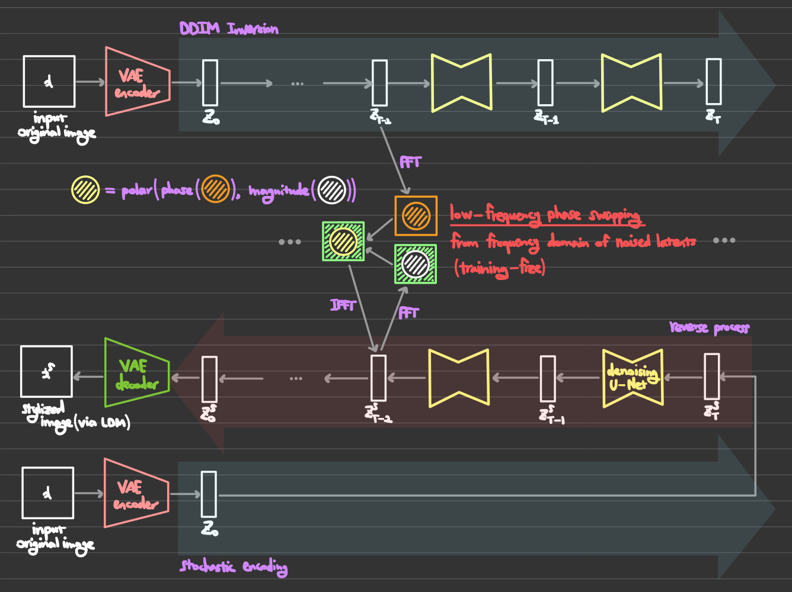
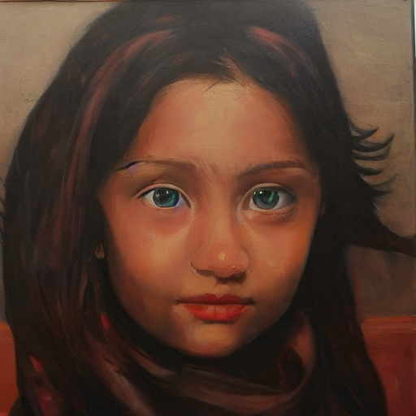
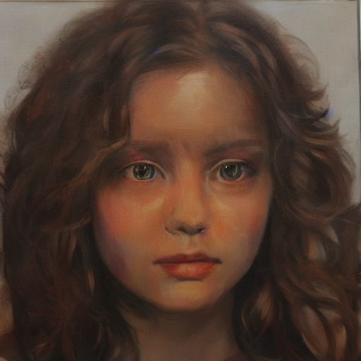
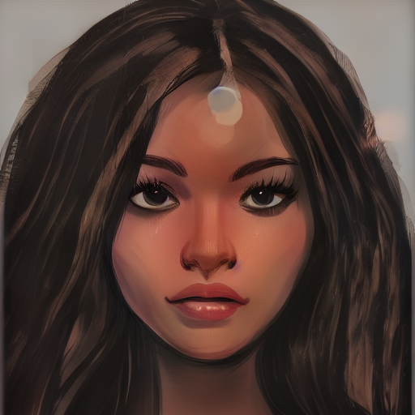

# Content Preservation by Low-frequency Phase Swapping in Diffusion-based Style Transfer


⚠️ **Research in Progress** ⚠️


## Model Diagram (Initial Version)



## Result (Initial Version)
The left image is the original, the center image shows the result with a text prompt, and **the right image shows the result with low-frequency phase swapping**.
(```cutoff_ratio``` = 0.2)

- LDM text prompt: **"Oil Panting"**
<figure>
    <a href="link"></a>
    <a href="link"></a>
    <a href="link"></a>
</figure>
<br/><br/>

- LDM text prompt: **"Monochrome Sketching"**
<figure>
    <a href="link"></a>
    <a href="link"></a>
    <a href="link"></a>
</figure>
<br/>


## Getting Started
### Prerequisites
```
conda env create -f environment.yaml
conda activate stable-diffusion
```

### Stable Diffusion & CLIP Weights
- Download the stable-diffusion-v-1-4 weights from the [CompVis organization at Hugging Face](https://huggingface.co/CompVis/stable-diffusion-v-1-4-original) (download the sd-v1-4.ckpt file), and link them:
```
mkdir -p models/ldm/stable-diffusion-v1
ln -s <path/to/model.ckpt> models/ldm/stable-diffusion-v1/model.ckpt 
```
- Download the clip-vit-large-patch14 weights from the [openai organization at Hugging Face](https://huggingface.co/openai/clip-vit-large-patch14) as follows:
```
git lfs install
mkdir -p models/clip
cd models/clip
git clone https://huggingface.co/openai/clip-vit-large-patch14
```

### Run
```cutoff_ratio``` (hyperparameters that control the range of low-frequency) can be modified from the ```ldm/models/diffusion/ddim.py``` file (0.0 <= ```cutoff_ratio``` <= 1.0).
<br/> (Will be updated to adjust ```cutoff_ratio``` at run stage)
```
python scripts/img2img.py --prompt <your_style_prompt> --init-img <your_content_img_dir> --outdir <your_output_folder_dir> --strength 0.8
```
