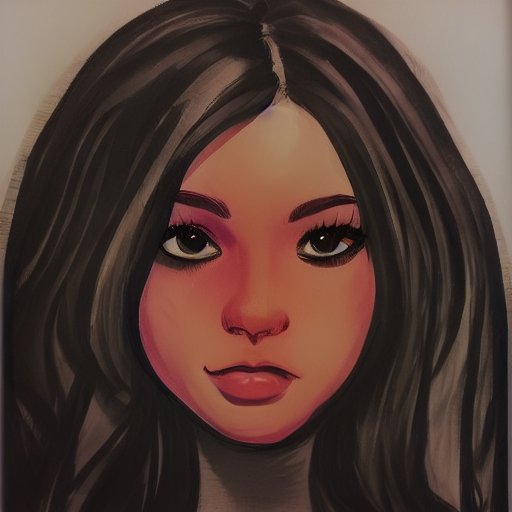

# Content Preservation by Low-frequency Phase Swapping in Diffusion-based Style Transfer
🧠 **\* Research in Progress \***

 
<figure>
    
    
    
    <figcaption>hello1</figcaption>
</figure>
  
<figure>
    
    
    
    <figcaption>hello1</figcaption>
</figure>
 
